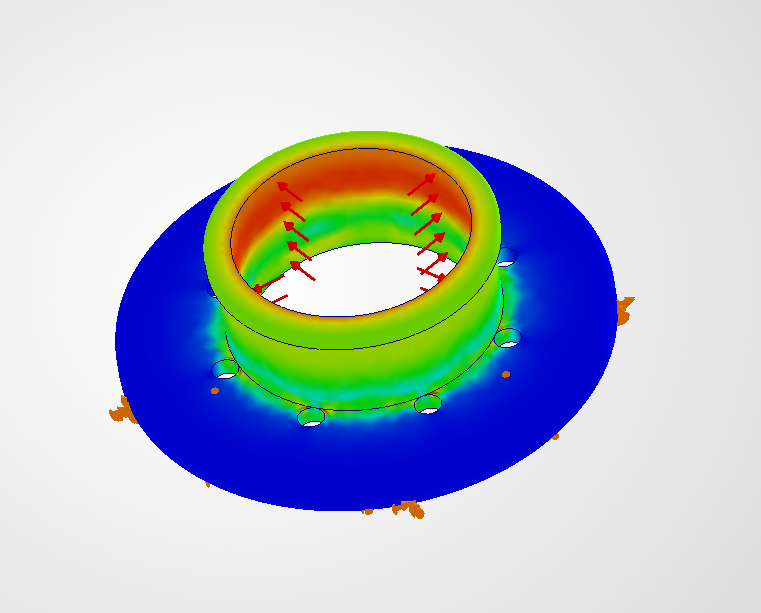
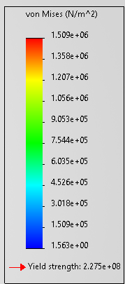

# Turbocharger System Design and Analysis

## Overview
This project focuses on the parametric design and engineering analysis of a turbocharger subsystem, with emphasis on centrifugal compressor geometry, volute airflow routing, housing integration, and preliminary structural validation. The project is being developed in SolidWorks using iterative CAD refinement, engineering-based design decisions, and simulation-driven evaluation.


---

## Objectives

- Design a realistic turbocharger compressor-side assembly
- Develop a centrifugal compressor wheel with curved blade geometry
- Create a functional volute housing with tangential outlet routing
- Improve internal airflow continuity through iterative geometry refinement
- Apply parametric CAD modeling and assembly practices in SolidWorks
- Conduct preliminary structural validation using FEA
- Document design progression, assumptions, and engineering trade-offs

---

## System Components

- Compressor Housing (Volute)
- Compressor Wheel (Impeller)
- Endplate / Mounting Structure
- Tangential Outlet Geometry
- Internal Airflow Passage

---

## Design Methodology

### 1. Research and Design Planning

- Reviewed centrifugal compressor and volute design principles
- Studied compressor airflow behavior and flow accumulation within volutes
- Referenced real turbocharger geometries, cutaways, and compressor housings
- Researched tongue/cutwater geometry and tangential outlet transitions

---

### 2. Compressor Wheel Development

- Developed initial compressor wheel geometry using revolve-based hub profiles
- Implemented curved blade geometry using lofts between sketches with spline guide curves
- Applied 12-blade circular pattern with consistent 3 mm blade thickness
- Refined blade curvature and blade spacing to better represent centrifugal airflow behavior
- Integrated compressor wheel into preliminary assembly configurations

---

### 3. Volute and Housing Development

- Designed preliminary volute housing geometry with tangential outlet integration
- Performed multiple redesign iterations of the volute to improve airflow routing and internal flow continuity
- Experimented with outlet placement, tongue/cutwater geometry, and airflow transition strategies
- Refined housing smoothness and transition regions using loft and fillet modifications
- Developed internal airflow path from compressor discharge region to outlet
- Modeled endplate and housing assembly with integrated bolt pattern geometry

#### Initial Volute Draft


#### Volute With Fillet Refinement


#### Volute With Compressor Inlet Integration
.png)

#### Circular Airflow Path Development


#### Endplate and Housing Geometry


#### Rear Housing View


---

## Assembly Development

- Integrated compressor wheel and housing geometry into an early-stage turbocharger assembly
- Refined component alignment and internal packaging
- Evaluated preliminary clearances between rotating and stationary geometry

#### Assembly Progress


#### Turbocharger Assembly Draft


---

## Engineering Considerations

- Internal airflow continuity and smooth transition regions
- Tangential outlet alignment for improved flow discharge
- Structural integrity of compressor-side housing geometry
- Manufacturability of volute and housing features
- Simplified aerodynamic representation of compressor wheel geometry
- Packaging and assembly integration between wheel and housing

---

## Materials

### Compressor Wheel
- Material: 7075-T6 Aluminum
- Selected for lightweight high-strength rotational application assumptions

### Compressor Housing
- Material: 6061-T4 Aluminum
- Selected for structural evaluation and manufacturability considerations

---

## Structural Analysis

- Conducted preliminary static structural FEA using internal pressure loading conditions
- Applied simplified internal pressure assumptions to compressor housing geometry
- Evaluated von Mises stress distribution and displacement behavior under simulated boost pressure loading
- Verified simulated stress levels remained significantly below material yield strength during initial validation testing

### von Mises Stress Distribution


### Stress Scale and Material Yield Comparison


### Analysis Notes

- Maximum simulated von Mises stress reached approximately 1.51 × 10^6 Pa under applied internal pressure loading conditions
- Assigned 6061-T4 aluminum housing material has an approximate yield strength of 2.275 × 10^8 Pa
- Simulated stress levels remained substantially below material yield strength, indicating that the housing did not approach yielding under the simplified loading case
- Highest stress concentrations occurred near constrained flange transition regions while remaining within acceptable structural limits
- Preliminary results indicate acceptable structural integrity and deformation behavior for the current compressor housing design iteration

#### Structural Housing Geometry


---

## Key Assumptions

- Steady-state airflow conditions
- Simplified impeller aerodynamic behavior
- Uniform material properties
- Simplified static pressure loading
- No transient thermal effects in current iteration

---

## Current Limitations

- Full CFD airflow simulation not yet implemented
- Rotating impeller physics not yet modeled
- Thermal loading between turbine and compressor regions not yet analyzed
- Volute geometry still undergoing optimization and refinement

---

## Future Work

- Internal CFD flow simulation and velocity visualization
- Rotating compressor wheel analysis
- Thermal analysis across compressor and turbine regions
- Improved tongue/cutwater geometry refinement
- Optimization of volute cross-sectional area growth
- Additional assembly detailing and mounting integration

---

## Tools and Software

- SolidWorks (CAD Modeling and Assembly)
- SolidWorks Simulation (Structural FEA)
- Excel / Python (Engineering calculations and data tracking)
README.md
LICENSE
```
